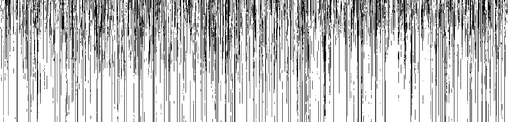

<!---->
<figure style="float: left; margin-right:50px; width:100%"></figure>

I am an Assistant Professor in the [Mathematics Department](https://www.hmc.edu/mathematics/) at [Harvey Mudd College](https://www.hmc.edu/). My research focuses are in mathematical data science, optimization, and applied convex geometry.  I leverage mathematical tools, such as those from probability, combinatorics, and convex geometry, on problems in data science and optimization. Areas in which I have been active recently include randomized numerical linear algebra, combinatorial methods for convex optimization, tensor decomposition for topic modeling, network consensus and ranking problems, and community detection on graphs and hypergraphs.

Before starting at HMC, I received my PhD in the [Graduate Group in Applied Mathematics](http://appliedmath.ucdavis.edu/) at the University of California, Davis where I was fortunate to be advised by [Professor Jesús A. De Loera](https://www.math.ucdavis.edu/~deloera), and then was a CAM Assistant Professor (post-doc) in the University of California, Los Angeles (UCLA) [Mathematics Department](https://ww3.math.ucla.edu/) where my exceptional postdoctoral mentor was [Professor Deanna Needell](https://www.math.ucla.edu/~deanna/).

<!-- Contact
===========
Email: <a href="mailto:jhaddock@g.hmc.edu">jhaddock@g.hmc.edu</a>
 Office: Shanahan 2408
<link href="https://assets.calendly.com/assets/external/widget.css" rel="stylesheet">

<a href="" onclick="Calendly.initPopupWidget({url: 'https://calendly.com/jamie-haddock'});return false;">Schedule time with me</a>-->

 Recent News
===========
<b>March '22: </b> I am co-organizing the Southern California Applied Mathematics Symposium (SOCAMS) with Heather Zinn-Brooks (Harvey Mudd College), Christina Edholm (Scripps College), Manuchehr Aminian (Cal Poly Pomona), Phil Chodrow (UCLA), Anna Ma (UCI), Adam MacLean (USC), Chris Miles (UCI), and Alona Kryshchenko (CSU Channel Islands).  This one-day meeting will be held on the campus of Harvey Mudd College on May 21, 2022!  This conference aims to bring together researchers from universities throughout Southern California, working in all areas of Applied Mathematics, for a one-day exchange of ideas in an informal and collaborative atmosphere. More information and registration available at <a href="https://www.socams.org">https://www.socams.org"</a>!

<b>February '22: </b> Elizaveta Rebrova (Princeton Univ. ORFE) and I are organizing sessions titled "Randomized Iterative Methods beyond Least-squares" and "Tensor Modeling and Optimization" for the "Optimization for Data Science and Machine learning" cluster at the seventh <a href="https://iccopt2022.lehigh.edu/">International Conference on Continuous Optimization (ICCOPT)</a> which will take place at Lehigh University in Bethlehem, Pennsylvania during July 25-28, 2022.  We have two great slates of speakers organized to speak on these topics!

<b>February '22: </b>Applications are now open for my funded summer undergraduate research projects <a href="https://uro.hmc.edu/projects">Tensor Models and Methods for Medical Imaging</a>, <a href="https://uro.hmc.edu/projects">Numerical Linear Algebraic Analyses of Opinion Dynamics on Networks</a>, and <a href="https://uro.hmc.edu/projects">Iterative Methods for Large-scale Systems of Linear Equations</a>!  Applications may be submitted via the HMC URO portal until February 20.

<b>January '22: </b> Our (with student <a href="http://www.joshvendrow.com/">Josh Vendrow</a>) paper <a href="https://arxiv.org/abs/2109.14820">A Generalized Hierarchical Nonnegative Tensor Decomposition</a> was accepted to the 2022 IEEE International Conference on Acoustics, Speech and Signal Processing (ICASSP)!  In this paper, we propose a hierarchical tensor decomposition model that generalizes a natural model for matrices, a property which many hierarchical tensor decomposition models lack.  This model naturally illuminates the hierarchy of latent topics in tensor-structured data.

<b>January '22: </b> I am coorganizing the MAA Session "Establishing Interdisciplinary Collaborations in Teaching and Research" at the Joint Mathematics Meeting (virtual) April 6-9, 2022 with Jessica Oehrlein (Fitchburg State University)!  Due to the transition to virtual format and the challenges of scheduling, this session will occur in March.  We have a great set of speakers who will lead an interactive session on how beginning and sustaining interdisciplinary collaboration with academics outside mathematics and industrial colleagues.

<b>December '21: </b> Our paper <a href="https://arxiv.org/abs/2009.08089">Quantile-based Iterative Methods for Corrupted Systems of Linear Equations</a> was accepted for publication in SIAM Journal on Matrix Analysis and Applications (SIMAX)!  In this paper, we propose iterative methods for solving large-scale and arbitrarily corrupted systems of equations.  We provide both theoretical and empirical evidence of the promise of these methods; our theoretical results build upon new and classical results in high-dimensional probability.

<b>November '21: </b> We (with student Chen Yap) submitted our paper <a href="https://arxiv.org/abs/2110.14609">Paving the Way for Consensus: Convergence of Block Gossip Algorithms</a>!  In this paper, we prove a new convergence bound for a broader class of randomized block Kaczmarz methods on a broader class of inconsistent linear systems, then utilize this convergence bound to prove convergence of the block gossip methods for average consensus.  We additionally specify the result to three popular types of block gossip protocols which utilize specific subgraph structures to iteratively update towards consensus.

<!--

<b>September '21: </b> Our papers "Neural Nonnegative CP Decomposition for Hierarchical Tensor Analysis" (with student <a href="http://www.joshvendrow.com/">Josh Vendrow</a>) and <a href="https://arxiv.org/abs/2010.07956">"Semi-supervised Nonnegative Matrix Factorization for Document Classification"</a> (with student Sixian Li) were accepted to the proceedings of the 55th Asilomar Conference on Signals, Systems, and Computers!  During that conference, I will additionally chair the session "Algorithms for Data Analytics".

<b>June '21: </b> I was selected for the MAA Project NExT Gold'21 cohort!  <a href="https://www.maa.org/programs-and-communities/professional-development/project-next">Project NExT</a> (New Experiences in Teaching) is a year-long professional development program for early career mathematicians that addresses all aspects of an academic career. Looking forward to participating in this program and to meeting the rest of the cohort!

<b>May '21: </b> Our grant <a href="https://www.nsf.gov/awardsearch/showAward?AWD_ID=2111440&HistoricalAwards=false">"Tensor Models, Methods, and Medicine"</a> was awarded by NSF DMS Computational Mathematics!  This award will support research developing supervised and hierarchical tensor models and efficient numerical and combinatorial methods for training these models, and an exciting collaboration with cardiologists at Harbor-UCLA Medical Center!  It will fund summer undergraduate research positions and summer workshops bringing experts on the mathematics of tensors together with application area experts.  If you are interested in either of these opportunities, please <a href="mailto:jhaddock@g.hmc.edu">reach out!</a>

<b>May '21: </b> We submitted our paper <a href="https://arxiv.org/abs/2105.09065">Statistical Learning for Best Practices in Tattoo Removal</a> (with student Richard Yim)!  This paper employs statistical and machine learning techniques to investigate best practices in laser-assisted tattoo removal.  This work is a collaboration with the largest gang rehabilitation and reentry organization in the world, <a href="https://homeboyindustries.org/">Homeboy Industries</a>!

<dt><h3>[Feb. '21]</h3></dt> <dd>Applications are now open for my funded summer undergraduate research project <a href="https://uro.hmc.edu/projects">Kaczmarz Methods for Large-scale Data Analysis</a>!  This project will be run in conjunction with the UCLA CAM REU and is partially funded by Harvey Mudd College.  Applications from undergraduates at any institution are welcome and can be submitted through <a href="https://www.mathprograms.org/db/programs/1067">MathPrograms</a>! If you are a Claremont colleges student, you can additionally apply at <a href="https://uro.hmc.edu/projects">HMC URO</a>.</dd>
<dt><h3>[Jan. '21]</h3></dt> <dd>Our paper <a href="https://arxiv.org/abs/2010.11365">On a Guided Nonnegative Matrix Factorization</a> (with student Josh Vendrow) was accepted to the 2021 IEEE International Conference on Acoustics, Speech and Signal Processing (ICASSP)!  In it, we propose an approach based upon the nonnegative matrix factorization (NMF) model, deemed Guided NMF, that incorporates user-designed seed word supervision. Our experimental results demonstrate the promise of this model and illustrate that it is competitive with other methods of this ilk with only very little supervision information!</dd>
<dt><h3>[Dec. '20]</h3></dt> <dd>Our paper <a href="http://arxiv.org/abs/1912.03544">Greed Works: An Improved Analysis of Sampling Kaczmarz-Motzkin</a> (with Anna Ma) was accepted for publication to the SIAM Journal on Mathematical Data Science (SIMODS)!  In this work, we present an improved convergence analysis of the Sampling Kaczmarz-Motzkin (SKM) family of methods on consistent systems of linear equations.  Our analysis illustrates the advantage of using greedier members of this family and presents intuition for why Motzkin's (maximal residual) method often converges faster than the Randomized Kaczmarz method! We additionally specialize our analysis to two specific forms of linear systems, including average consensus systems.</dd>
<dt><h3>[Nov. '20]</h3></dt> <dd>Our paper <a href="https://arxiv.org/abs/1905.13404">Data-driven Algorithm Selection and Tuning in Optimization and Signal Processing</a> was accepted for publication to the Annals of Mathematics and Artificial Intelligence! In this paper, we train machine learning methods to automatically improve the performance of optimization and signal processing algorithms. As a proof of concept, we use our approach to improve two popular data processing subroutines in data science: stochastic gradient descent and greedy methods in compressed sensing!</dd>
<dt><h3>[Oct. '20]</h3></dt> <dd>We (with student Edwin Chau) submitted the paper <a href="https://arxiv.org/abs/2010.10635">On Application of Block Kaczmarz Methods in Matrix Factorization</a>!  In this work, we discuss and test a block Kaczmarz solver that replaces the least-squares subroutine in the common alternating scheme for matrix factorization. This variant trades a small increase in factorization error for significantly faster algorithmic performance. In doing so we find block sizes that produce a solution comparable to that of the least-squares solver for only a fraction of the runtime and working memory requirement!</dd>
<dt><h3>[Oct. '20]</h3></dt> <dd>We (with student Sixian Li) submitted the paper <a href="http://arxiv.org/abs/2010.07956">Semi-supervised NMF Models for Topic Modeling in Learning Tasks</a>!  In this work, we propose several new semi-supervised NMF (SSNMF) models and show that these are naturally formulated as the maximum likelihood estimators given a generative factorization model and assumed distributions of uncertainty in the observed data.  We develop training methods for the general forms of these models and illustrate how to apply them to the classification task; our experiments show that these methods are very promising and achieve high classification accuracy on the 20 Newsgroups data (while also developing a coherent topic model and classifying in a low-dimensional space)!</dd>
<dt><h3>[Sep. '20]</h3></dt> <dd>We (with student Josh Vendrow) submitted the paper "Neural Nonnegative CP Decomposition for Hierarchical Tensor Analysis"!  We propose a model for hierarchical tensor decomposition and a neural network-inspired technique for training the model.  This model allows a user to decompose a tensor at different granularities (ranks) and to visualize the relationship between the learned topics at different levels of hierarchy!</dd>
<dt><h3>[Sep. '20]</h3></dt> <dd>We submitted the paper <a href="https://arxiv.org/abs/2009.08089">Quantile-based Iterative Methods for Corrupted Systems of Linear Equations</a>!  In this paper, we propose iterative methods for solving large-scale and arbitrarily corrupted systems of equations.  We provide both theoretical and empirical evidence of the promise of these methods; our theoretical results build upon new and classical results in high-dimensional probability.</dd>
<dt><h3>[Sep. '20]</h3></dt> <dd>We submitted the paper "Weakly-Supervised Object Localization using Semi-supervised Nonnegative Matrix Factorization"!  We combine a new form of semi-supervised nonnegative matrix factorization with convolutional neural network filters to produce a successful model for object localization in multi-class image datasets.</dd>
<dt><h3>[Sep. '20]</h3></dt> <dd>Our paper <a href="https://arxiv.org/abs/2001.00631">On Large-Scale Dynamic Topic Modeling with Nonnegative CP Tensor Decomposition</a> was accepted for publication in the Proceedings of the Women in Data Science and Mathematics (WiSDM) Workshop!  This collaboration was begun at the Research Collaboration Workshop for <a href="https://icerm.brown.edu/topical_workshops/tw19-5-wisdm/">Women in Data Science and Mathematics</a>, July 2019 held at <a href="https://icerm.brown.edu/">ICERM</a> (funded by ICERM, <a href="https://awm-math.org/">AWM</a> and <a href="http://dimacs.rutgers.edu/">DIMACS</a> (NSF grant CCF1144502)).</dd>
<dt><h3>[Aug. '20]</h3></dt> <dd>We (with student Josh Vendrow) submitted the paper <a href="https://arxiv.org/abs/2009.09087">Feature Selection on Lyme Disease Patient Survey Data</a>!  In this work, we use basic machine learning techniques to perform feature selection on a large-scale survey dataset from a private Lyme disease patient database, <a href="https://www.lymedisease.org/mylymedata-lyme-disease-research/">MyLymeData</a>.</dd>

I received the AMS-Simons Foundation Travel Grant for 2018-2020.
 -->
